# Android 车机 AI 集成架构方案

> 基于 Google ADK Kotlin (Android) + 可插拔 AIBox 大模型推理盒
>
> 文档中的图为 Mermaid 格式，可在 Android Studio / VS Code / GitHub 中直接渲染。

---

## 目录

1. [方案概述](#1-方案概述)
2. [整体架构](#2-整体架构)
3. [核心交互流程](#3-核心交互流程)
4. [模块详细设计](#4-模块详细设计)
   - 4.1 输入层
   - 4.2 Agent 层 (ADK)
   - 4.3 AIBox 通信层
   - 4.4 Tools 执行层
   - 4.5 输出层
5. [AIBox 热插拔与降级策略](#5-aibox-热插拔与降级策略)
6. [安全与权限设计](#6-安全与权限设计)
7. [性能与时延优化](#7-性能与时延优化)
8. [常见理解误区澄清](#8-常见理解误区澄清)
9. [工程落地路线图](#9-工程落地路线图)

---

## 1. 方案概述

### 1.1 目标

在 Android 车机（AAOS / 定制 Android）上集成大模型能力，实现：

- **自然语言车控**：如"有点热，把空调调到 22 度"
- **多轮对话**：具备上下文记忆的语音助手
- **多模态输入**：语音、触屏 UI、方向盘物理按键统一进入同一 Agent
- **算力解耦**：大模型推理运行在**可插拔的 AIBox** 上，车机本体不承担推理算力

### 1.2 核心设计原则

| 原则 | 说明 |
|---|---|
| **Agent 为控制中枢** | 所有决策循环、工具执行、安全校验都在车机侧的 ADK Agent 内完成 |
| **AIBox 只做推理** | AIBox 是无状态的"大脑算力"，只输入 prompt、输出文本 / tool-call 指令 |
| **协议标准化** | AIBox 暴露 OpenAI 兼容 API，换模型 / 换盒子对车机零改动 |
| **可降级** | AIBox 未插入 / 故障时，基础车控功能仍可用 |
| **安全优先** | 任何车控 Tool 必须经过权限白名单 + 参数校验 + 危险操作二次确认 |

### 1.3 角色定位一句话

```
用户输入  →  Agent(车机, ADK) 主导循环  ⇄  AIBox(推理)  →  Agent 执行 Tools  →  反馈用户
```

**Agent 是大脑的"意志"，AIBox 是大脑的"算力"。**

---

## 2. 整体架构

### 2.1 分层架构图

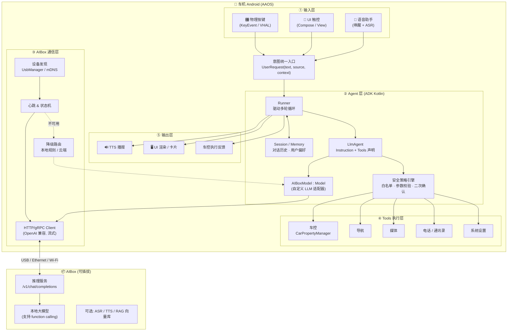

### 2.2 部署视图

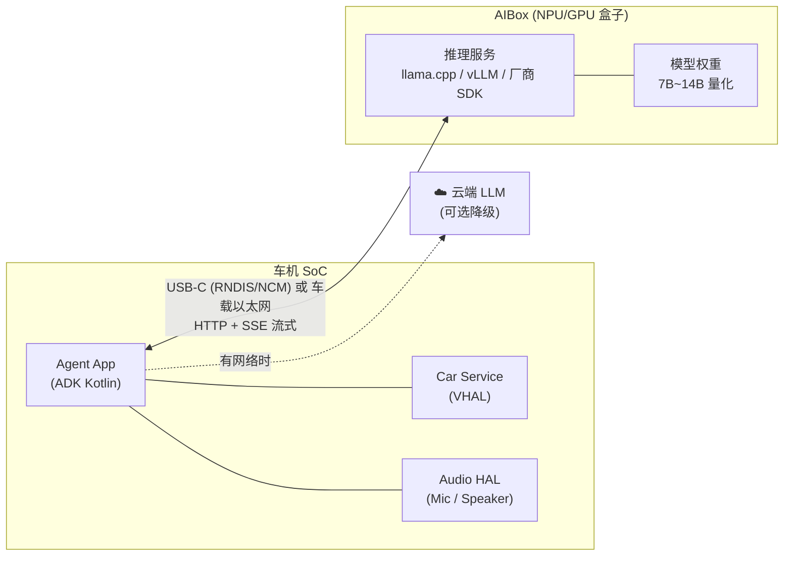

---

## 3. 核心交互流程

### 3.1 单次请求完整时序（含 Tool 调用循环）

> **关键认知**：LLM 不会"回调"Agent，它只是返回一段 `tool_call` JSON。
> Agent 解析后**自己执行**，再把结果**再次发给** LLM，如此循环直到 LLM 给出最终回答。

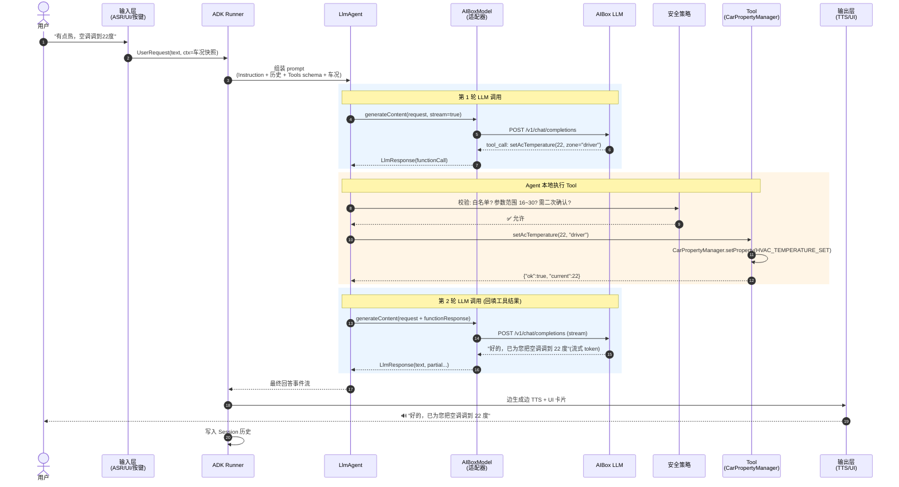

### 3.2 Agent 决策循环状态机

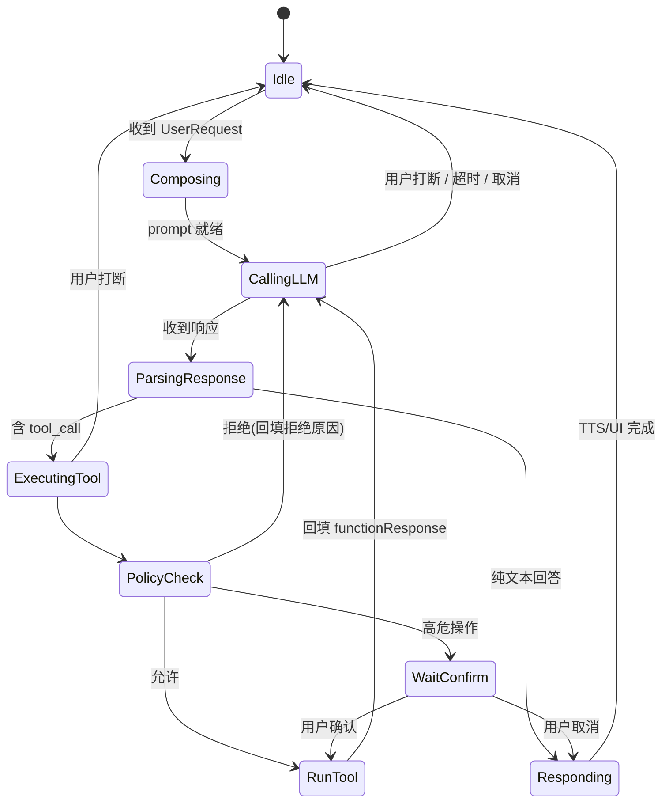

### 3.3 三种输入源的归一化

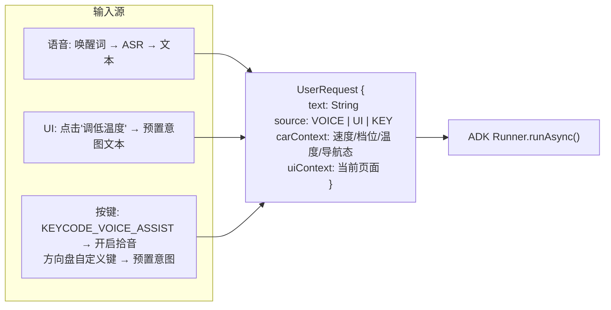

---

## 4. 模块详细设计

### 4.1 输入层

| 输入源 | 技术实现 | 备注 |
|---|---|---|
| 语音 | 唤醒词引擎(本地) → ASR | ASR 建议**本地/车机端**优先，保证无 AIBox 时仍可用；AIBox 可作增强 |
| UI | Compose 点击事件 → 生成意图文本 | 例如按钮"我要去公司" → `text="导航到公司"` |
| 物理按键 | `KeyEvent.KEYCODE_VOICE_ASSIST`、VHAL `HW_KEY_INPUT` | 长按/短按区分：短按拾音、长按取消 |

### 4.2 Agent 层 (ADK Kotlin)

当前工程 `HelloTimeAgent.kt` 的结构可直接演进：

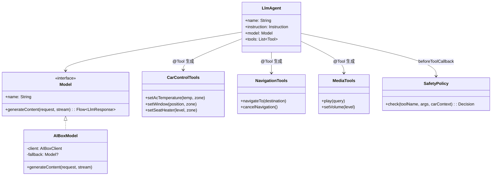

**关键实现点：**

1. **`AIBoxModel : Model`** —— 替换现有 `Gemini(...)`，实现 `generateContent()`，内部把 ADK 的 `LlmRequest`（含 tools schema）转成 OpenAI `chat/completions` 请求，再把返回的 `tool_calls` / `content` 转回 `LlmResponse`。
2. **Tools 用 `@Tool` / `@Param` 注解** —— KSP 自动生成 schema，与现有 `TimeService` 写法一致。
3. **Session** —— 用 ADK `SessionService` 保存多轮历史；按驾驶员账号隔离。
4. **动态 Instruction** —— 每次请求把车况快照注入 system prompt，如：
   `当前车速 60km/h、档位 D、车内 28℃、导航中(剩余 12 分钟)`，让模型少问多做。

### 4.3 AIBox 通信层

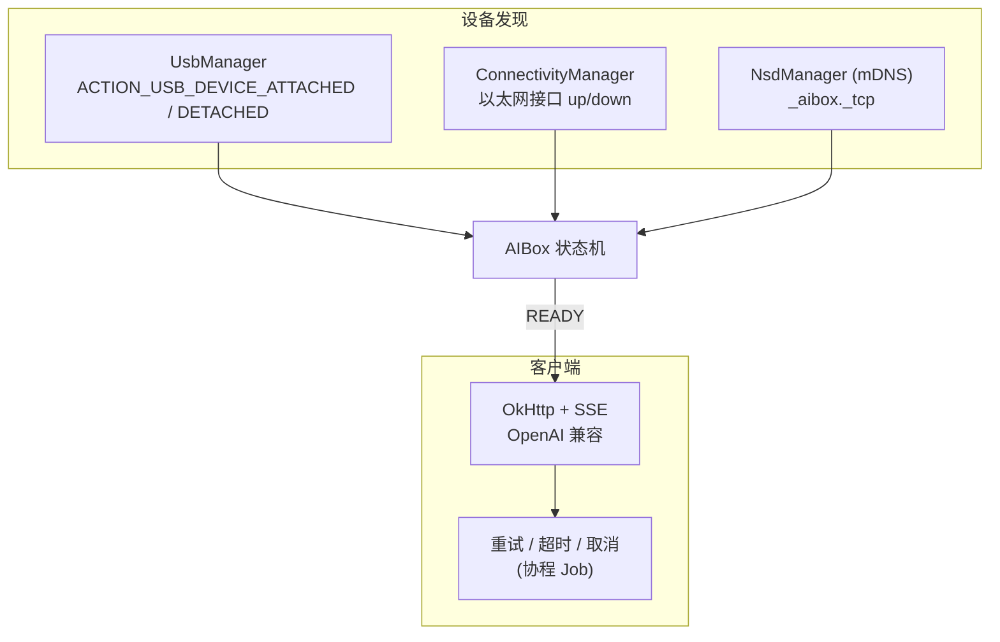

**协议约定（AIBox 侧需实现）：**

| Endpoint | 用途 |
|---|---|
| `GET /health` | 心跳，返回模型名 / 加载状态 / 负载 |
| `POST /v1/chat/completions` | 推理，支持 `tools`、`tool_choice`、`stream=true` |
| `GET /v1/models` | 模型能力发现（上下文长度、是否支持 function calling） |
| `POST /v1/audio/transcriptions` | 可选：AIBox 端 ASR |

**物理链路选型：**

| 链路 | 优点 | 缺点 |
|---|---|---|
| USB-C (RNDIS / NCM 网卡模式) | 供电+数据一体，带宽足 | 需要车机 USB Host 支持网卡驱动 |
| 车载以太网 (100BASE-T1) | 稳定、低延迟 | 需要硬件预留 |
| Wi-Fi P2P | 无线便捷 | 干扰、功耗、配对复杂 |

### 4.4 Tools 执行层

```mermaid
flowchart LR
    LLM["LLM 返回<br/>tool_call JSON"] --> PARSE["参数反序列化<br/>+ Schema 校验"]
    PARSE --> WL{"白名单?"}
    WL -->|否| REJ["拒绝, 回填原因"]
    WL -->|是| RANGE{"参数范围合法?<br/>(温度 16~30)"}
    RANGE -->|否| REJ
    RANGE -->|是| RISK{"危险等级"}
    RISK -->|L0 只读| EXEC["执行"]
    RISK -->|L1 舒适控制| EXEC
    RISK -->|L2 行车相关<br/>(车窗/后备箱)| SPEED{"车速 > 0?"}
    SPEED -->|是| CONFIRM["语音/UI 二次确认"]
    SPEED -->|否| EXEC
    RISK -->|L3 高危<br/>(解锁/支付)| CONFIRM
    CONFIRM -->|确认| EXEC
    CONFIRM -->|取消| REJ
    EXEC --> RESULT["结构化结果<br/>回填 LLM"]
```

**工具分级示例：**

| 等级 | 示例 | 策略 |
|---|---|---|
| L0 只读 | 查油量、查天气、查时间 | 直接执行 |
| L1 舒适 | 空调、座椅加热、音乐、音量 | 直接执行 |
| L2 行车相关 | 车窗、天窗、后备箱、导航目的地变更 | 行驶中需确认 |
| L3 高危 | 车门解锁、支付、删除数据 | 始终确认 + 身份校验 |

### 4.5 输出层

- **流式 TTS**：LLM 每输出一个句子片段即送 TTS，首字延迟 < 1s
- **UI 卡片**：Tool 结果渲染为结构化卡片（导航路线、歌曲封面）
- **打断机制**：方向盘按键 / 新唤醒 → `Job.cancel()` 同时取消 LLM 请求和 TTS

---

## 5. AIBox 热插拔与降级策略

### 5.1 AIBox 状态机

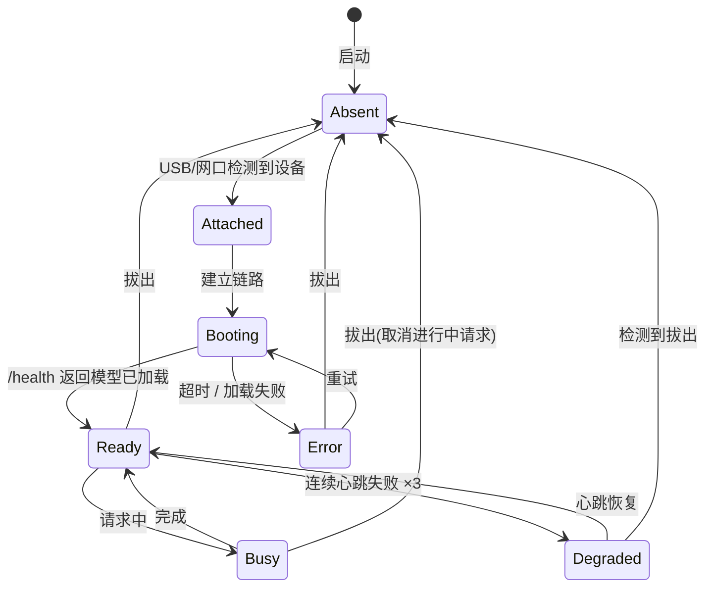

### 5.2 降级路由

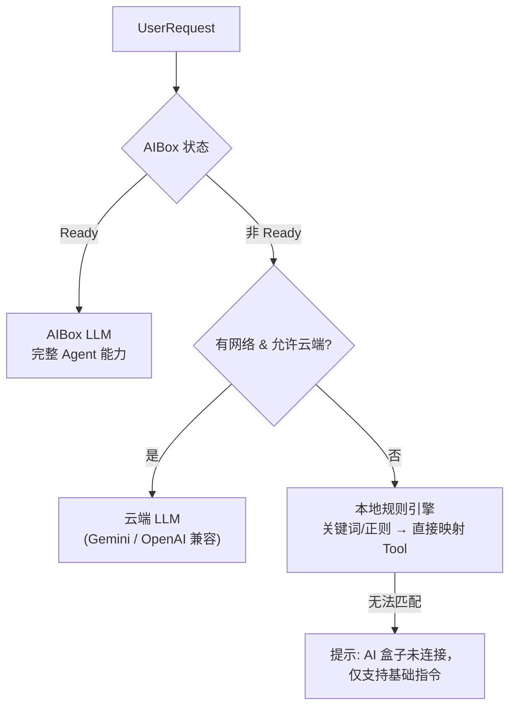

> 降级层同样实现 `Model` 接口（或在 `AIBoxModel` 内部做 fallback），**Agent 代码无需感知**。

---

## 6. 安全与权限设计

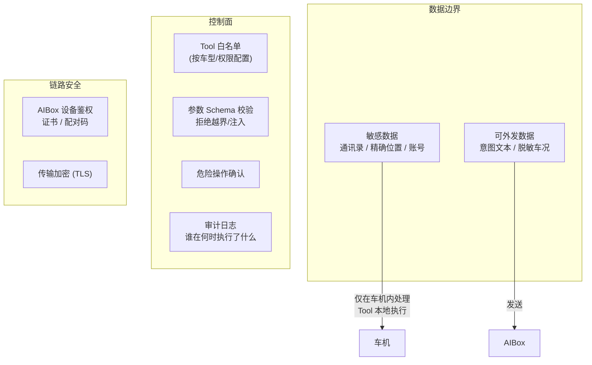

**要点：**

- **Prompt 注入防护**：LLM 输出的参数视为**不可信输入**，一律做 Schema + 业务范围校验
- **凭证管理**：任何 API Key **禁止硬编码进 APK**（当前 `HelloTimeAgent.kt` 中的示例 Key 需移除，改为安全存储或后端下发）
- **设备鉴权**：只接受配对过的 AIBox，防止恶意设备伪装
- **最小权限**：Agent App 只申请必要的 `Car.PERMISSION_*`

---

## 7. 性能与时延优化

```mermaid
gantt
    title 一次"调空调"请求的时延分解 (目标 < 2.5s 首字反馈)
    dateFormat X
    axisFormat %L ms

    section 输入
    ASR 识别            :0, 400
    section 第1轮 LLM
    组装 prompt         :400, 450
    AIBox 推理(tool_call):450, 1100
    section Tool
    策略校验 + 执行      :1100, 1250
    section 第2轮 LLM
    AIBox 推理(首 token) :1250, 1800
    section 输出
    TTS 首字播报         :1800, 2200
```

| 优化手段 | 效果 |
|---|---|
| **流式输出 + 分句 TTS** | 首字反馈时间大幅降低 |
| **System Prompt KV Cache** | AIBox 侧缓存固定 system prompt，减少 prefill |
| **Tool 结果精简** | 只回填必要字段，减少第 2 轮 token |
| **简单指令跳过第 2 轮** | 对 L0/L1 工具可用模板直接播报"已调到 22 度"，省一次 LLM 调用 |
| **并行 Tool 执行** | 多个 tool_call 并发（协程 `async`） |
| **本地 ASR** | 避免音频跨设备传输 |
| **预连接 / 长连接** | AIBox Ready 时保持 HTTP keep-alive |

---

## 8. 常见理解误区澄清

### 8.1 原始理解 vs 修正后

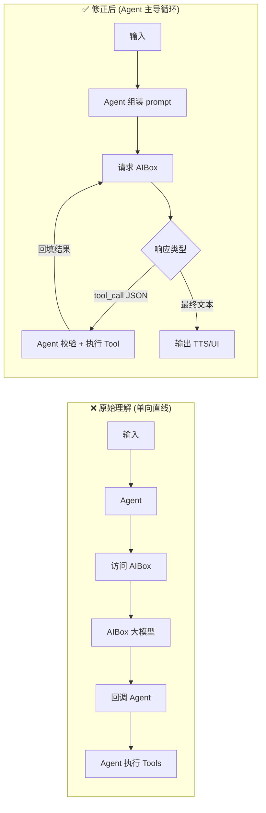

### 8.2 逐条澄清

| # | 原始理解 | 问题 | 正确认知 |
|---|---|---|---|
| 1 | "AIBox 回调 Agent" | 大模型是**无状态被调用方**，不会主动回调 | LLM 只**返回**一段 `tool_call` JSON；Agent 解析后自己执行，**再次请求** LLM |
| 2 | 流程是单向直线 | 实际是**循环** | 一次用户请求 = 2~N 次 LLM 调用；超时/取消/打断要按循环设计 |
| 3 | 语音直接进 Agent | 漏了 ASR/TTS | 语音 → **ASR** → Agent → … → **TTS**；ASR/TTS 部署位置需单独决策 |
| 4 | 未考虑"插拔" | AIBox 可能不在 | 必须有状态机 + 降级路径 |
| 5 | Tools 执行无门槛 | LLM 输出不可信 | 白名单 + 参数校验 + 危险分级确认 |

### 8.3 正确的部分

- ✅ 分层思路正确：输入 → Agent → 推理 → Tools
- ✅ 把大模型放在 AIBox、Agent 放车机，算力与控制解耦是合理的
- ✅ 用 ADK 做 Agent 框架，Tools 通过注解注册，与当前工程一致

---

## 9. 工程落地路线图

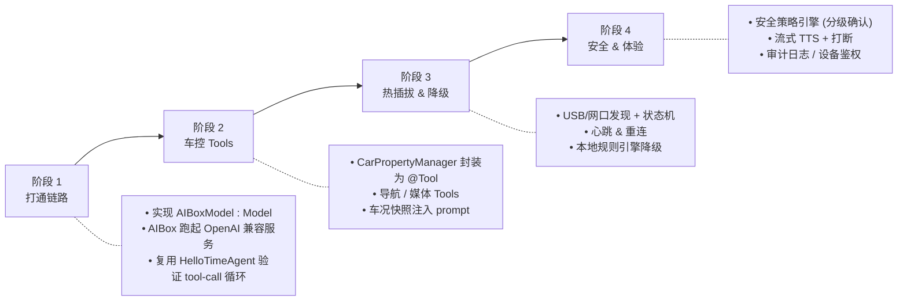

### 与当前工程的对应关系

| 当前文件 | 演进方向 |
|---|---|
| `HelloTimeAgent.kt` → `TimeService` | 拆分为 `CarControlTools` / `NavigationTools` / `MediaTools`，保持 `@Tool` 注解写法 |
| `HelloTimeAgent.kt` → `class OpenAI : Model` (TODO) | 实现为 `AIBoxModel`，对接 AIBox 的 OpenAI 兼容接口 |
| `HelloTimeAgent.kt` → `model = Gemini(...)` | 替换为 `AIBoxModel(fallback = Gemini(...))` |
| `MainActivity.kt` | 增加输入归一化层：接收语音/UI/按键 → `UserRequest` |
| 新增 | `AIBoxManager`（发现 + 状态机 + 心跳）、`SafetyPolicy`（beforeToolCallback） |

---

*文档版本 v1.0 · 生成于 2026-09-04*
